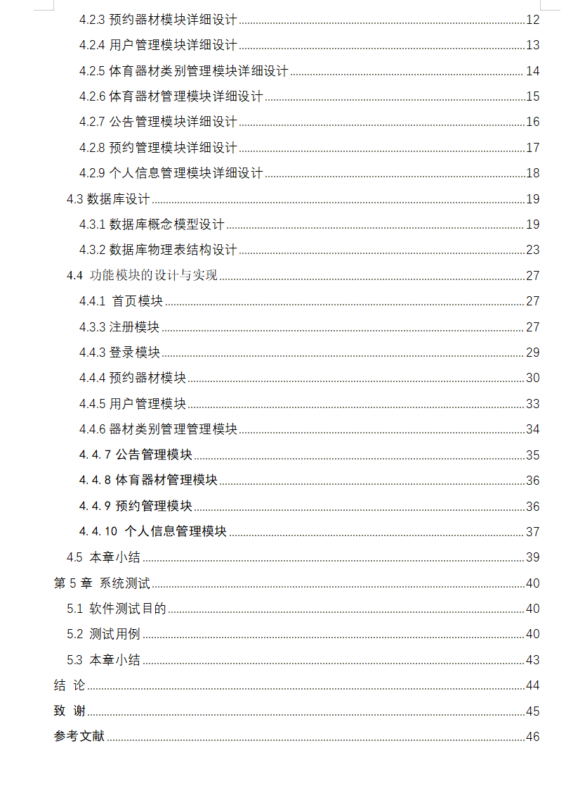
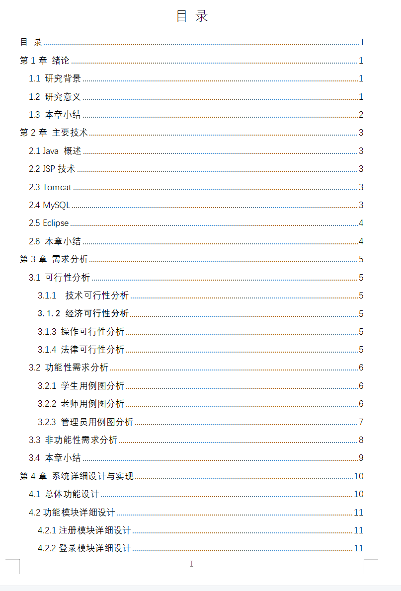
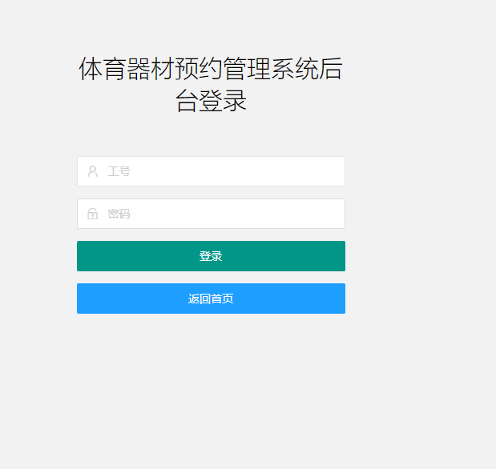
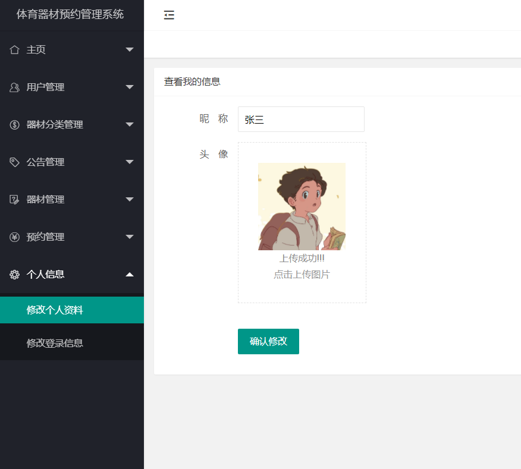
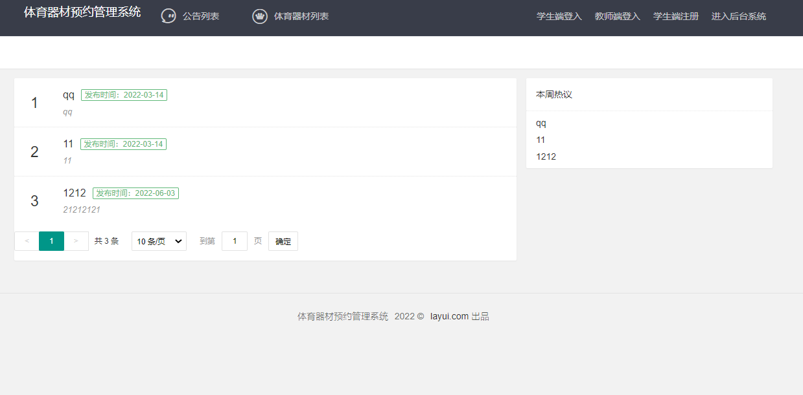
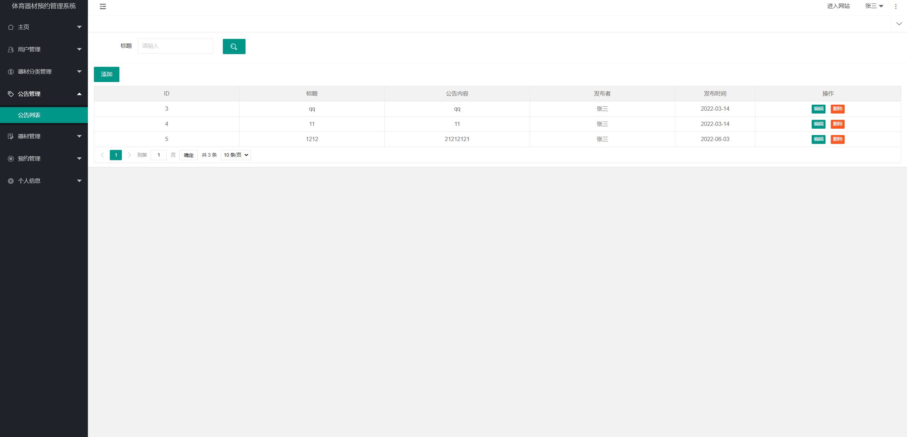
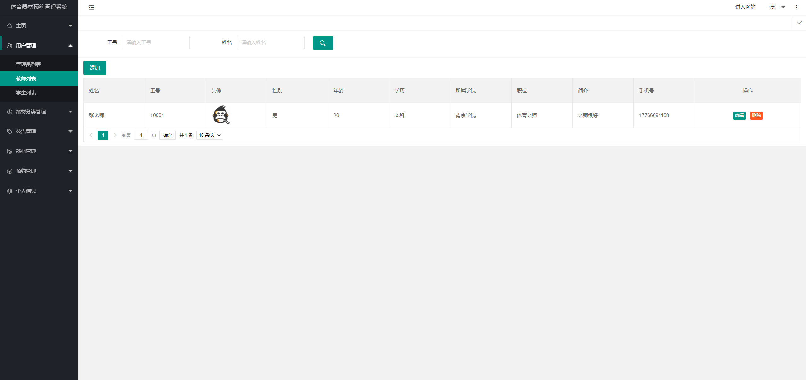
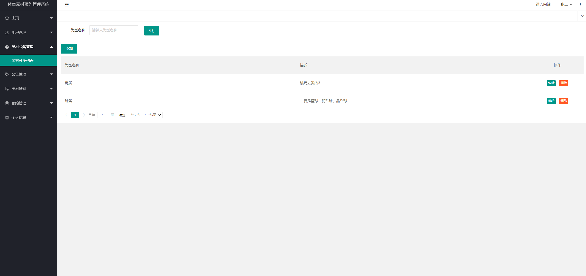
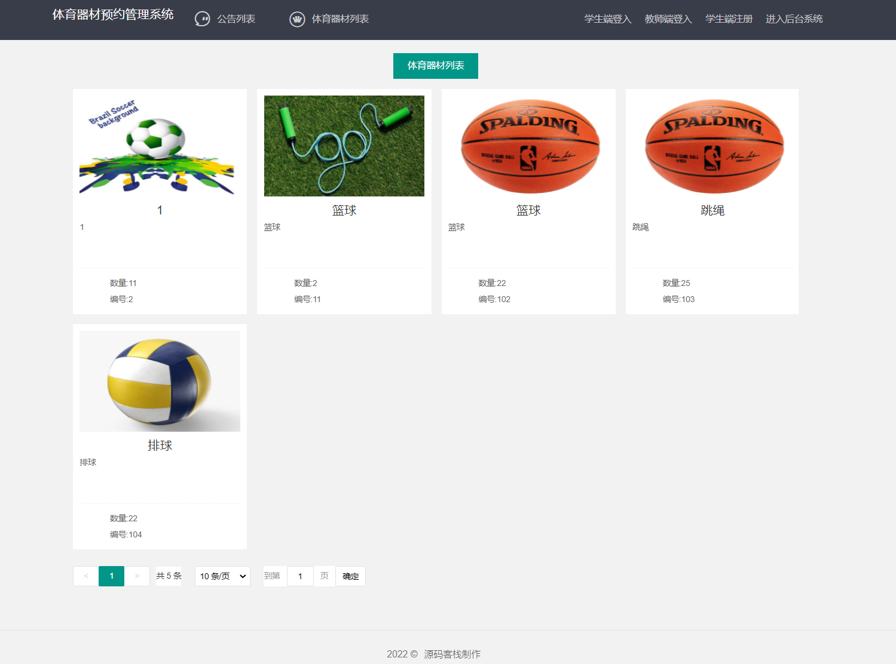

基于SSM的体育器材预约系统（程序+论文）
=
### 完整代码获取地址：从戎源码网 ([https://armycodes.com/](https://armycodes.com/))
### 作者微信：19941326836  QQ：952045282 
### 承接计算机毕业设计、Java毕业设计、Python毕业设计、深度学习、机器学习
### 选题+开题报告+任务书+程序定制+安装调试+论文+答辩ppt 一条龙服务
### 所有选题地址https://github.com/nature924/allProject

一、项目介绍
---
基于SSM框架实现的体育器材预约系统包含两种角色：管理员、用户,系统分为前台和后台两大模块，主要功能如下。

学生端主要功能有注册、登录、个人信息管理、查看我的预约信息、归还器材等功能
### 
【老师】端需要实现的主要功能有登录、归还器材、个人信息管理、我的预约信息。
### 
【管理员】端主要功能有登录、用户管理、体育器材类别管理、器材管理、预约管理、数据统计、以及公告管理、个人信息管理等功能。

二、项目技术
---
- 编程语言：Java
- 数据库：MySQL
- 项目管理工具：Maven
- 前端技术：JSP、HTML、Jquery、Layui、ECharts
- 后端技术：Spring、SpringMVC、MyBatis

三、运行环境
---
- 操作系统：Windows、macOS都可以
- JDK版本：JDK1.8以上都可以
- 开发工具：IDEA、Ecplise、Myecplise都可以
- 数据库: MySQL5.7以上都可以
- Tomcat：任意版本都可以
- Maven：任意版本都可以

四、运行截图
---
### 论文截图：

### 程序截图：

